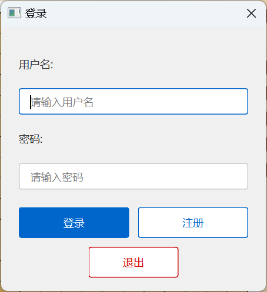
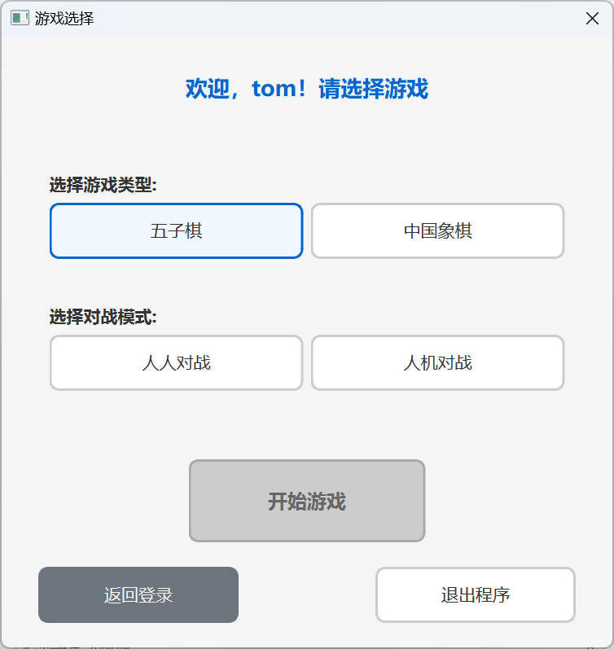
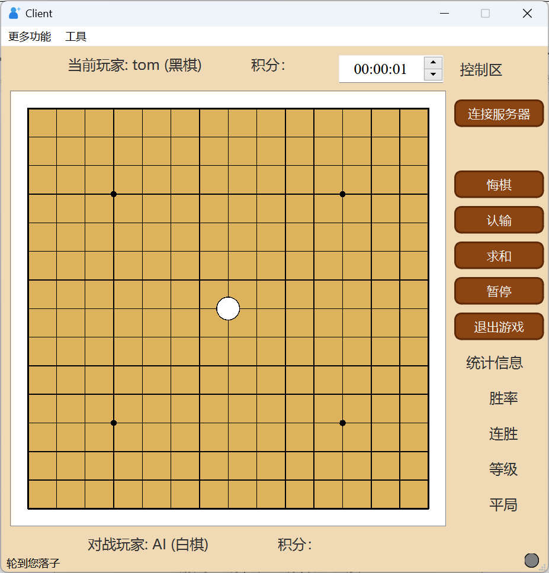
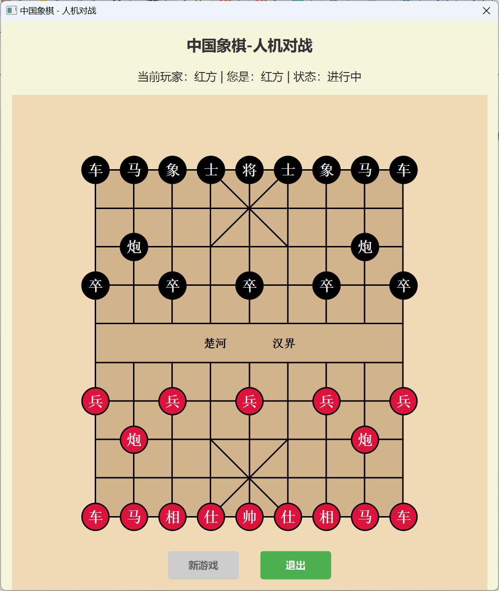

五子棋，中国象棋
=============================
这是一个功能完整的五子棋对战平台，支持本地人机对战和网络人人对战。项目采用模块化设计，包含棋盘管理、AI决策、网络通信、音效系统等核心模块。玩家可以选择与智能AI对战或通过TCP/IP协议与远程玩家实时对战，系统提供实时聊天、胜负判定、战绩统计等功能。界面包含游戏模式选择、用户登录、在线玩家列表等交互对话框，支持音效反馈和状态指示灯显示。采用C++/Qt 6.6.0开发，具有跨平台能力。

中国象棋项目实现了完整的人机对战功能，包含棋盘逻辑、走棋规则、AI智能和图形界面。AI采用Minimax算法和Alpha-Beta剪枝，支持5级难度调整。界面美观，棋子绘制精准，支持鼠标操作和移动提示。游戏流程完整，包含胜负判定、将军提示和回合切换。

​
视频讲解01：https://www.bilibili.com/video/BV18t4czKEB6/?vd_source=b2eaaddb2c69bf42517a2553af8444ab

视频讲解02：https://www.douyin.com/video/7559882010752257323

代码下载地址01：https://github.com/KeepTryingTo/Qt_Gomoku_Chinese_Chess

代码下载地址02：https://github.com/KeepTryingTo/QT_Learning/tree/main/QtGomoku_Chinese_Chess

​

登录界面，游戏选择界面，五子棋界面和中国象棋界面
---------------------------------------------






🔄 工作流程
=============================
​​用户登录​​ → 选择游戏模式 → 开始对战
​​本地对战​​：直接开始人人或人机对战
五子棋​​网络对战​​：浏览在线用户 → 发起挑战 → 实时对战
中国象棋本地对战：象棋部分只实现了人机对战

五子棋功能实现
=============================
```
Client（主窗口）
├── Board（棋盘管理器）
├── PieceType（棋子类型枚举）
├── Player（玩家信息管理器）
├── AIGameController（人机对战控制器）
├── Client（主客户端界面控制器）
├── GameSelectionDialog（游戏模式选择对话框）
├── LoginDialog（用户登录对话框）
├── NetworkManager（网络对战管理器）
├── NetworkProtocol（网络通信协议）
├── OnlineUsersManager（在线用户管理器）
├── OnlineUsersDialog（在线用户列表对话框）
├── ConnectionDialog（连接设置对话框）
├── ChatDialog（实时聊天对话框）
├── LedIndicator（LED状态指示灯）
├── SoundManager（音效管理系统）
├── Common（公共工具类）
└── Ui_Client（界面布局类）
```

🎮 游戏基础架构
----------------------------
* ​Board（棋盘管理器）​​ - 棋盘状态逻辑管理
* ​PieceType（棋子类型）​​ - 黑白棋子类型定义
* ​Player（玩家信息）​​ - 玩家数据与统计管理
* ​Client（主客户端）​​ - 游戏主界面控制器

⚔️ 游戏模式支持
----------------------------
* ​AIGameController（AI对战控制器）​​ - 人机对战逻辑​
* ​PVPGameMode（人人对战）​​ - 通过Client和Board实现的双人对战

🎨 用户界面组件
----------------------------
* ​LEDIndicator（状态指示灯）​​ - 连接/游戏状态可视化指示
* ​GameSelectionDialog（模式选择对话框）​​ - 游戏模式选择界面
* ​LoginDialog（用户登录对话框）​​ - 玩家身份验证界面

🌐 网络对战系统
----------------------------
* ​NetworkManager（网络管理器）​​ - 网络连接与通信管理
* ​NetworkProtocol（网络协议）​​ - 数据传输格式规范
* ​OnlineUsersManager（在线用户管理）​​ - 用户状态维护
* ​​OnlineUsersDialog（用户列表对话框）​​ - 在线玩家浏览界面
* ​ConnectionDialog（连接设置对话框）​​ - 网络参数配置

💬 社交互动功能
----------------------------
* ​ChatDialog（聊天对话框）​​ - 实时消息通信系统

🔊 多媒体支持
----------------------------
* ​SoundManager（音效管理器）​​ - 游戏音效播放控制

🔧 工具支持
----------------------------
* ​​Common（公共工具类）​​ - 通用定义与辅助函数


​
数据库SQLite
============================
（登录的用户名和密码是保存在SQLite数据库中）的，使用的软件为DB Browser

[数据库SQLite主页](https://www.sqlite.org/index.html)

SQLite 是一个 C 语言库，它实现了一个 小型、 快速、 独立、 高可靠性且 功能齐全的SQL 数据库引擎。SQLite 是世界上使用最广泛的数据库引擎。SQLite 内置于所有手机和大多数计算机中，并且与人们日常使用的无数其他应用程序捆绑在一起。

[DB Browser数据库软件下载（界面操作）](https://sqlitebrowser.org/dl/)

​


中国象棋功能实现
============================
```
中国象棋实现部分结构
├── ChessBoard（棋盘管理器）
│   ├── 棋盘状态维护（10行×9列网格）
│   ├── 棋子移动规则验证
│   │   ├── 车：直线移动路径检查
│   │   ├── 马：日字移动蹩马腿检查
│   │   ├── 炮：直线移动翻山吃子
│   │   ├── 兵：过河前后移动限制
│   │   ├── 将/帅：九宫格内移动
│   │   ├── 士/仕：斜线九宫格移动
│   │   └── 象/相：田字移动塞象眼检查
│   ├── 游戏状态判定
│   │   ├── 将军状态检测
│   │   ├── 将死判定逻辑
│   │   └── 困毙（无子可动）判定
│   └── 合法走法生成
│
├── ChessPiece（棋子系统）
│   ├── 棋子类型枚举（7种棋子+空位）
│   ├── 棋子颜色枚举（红方/黑方）
│   └── 棋子坐标位置管理
│
├── ChessAIController（AI智能引擎）
│   ├── 难度级别设置（1-5级）
│   ├── Minimax搜索算法
│   ├── Alpha-Beta剪枝优化
│   ├── 棋盘评估函数
│   │   ├── 棋子价值权重（将10000，车900等）
│   │   ├── 位置奖励系统
│   │   └── 将军状态加分
│   └── 走法搜索策略
│
├── ChessGameController（游戏流程控制）
│   ├── 游戏初始化（红方先手）
│   ├── 回合制切换管理
│   ├── 人类玩家移动处理
│   ├── AI自动思考触发
│   └── 游戏结束条件检测
│
├── ChessBoardWidget（图形界面）
│   ├── 棋盘绘制（网格线、九宫格、楚河汉界）
│   ├── 棋子可视化渲染
│   │   ├── 圆形棋子绘制
│   │   ├── 红黑颜色区分
│   │   └── 汉字标识显示
│   ├── 交互功能
│   │   ├── 鼠标点击坐标转换
│   │   ├── 选中状态高亮显示
│   │   └── 合法走法位置提示
│   └── 游戏状态实时更新
│
└── ChessMainWindow（主窗口集成）
    ├── 游戏模式选择（人机对战）
    ├── 玩家方选择（红方/黑方）
    ├── 状态信息显示
    ├── 新游戏/退出控制
    └── 胜负结果提示
```


打包QT程序为exe文件
===============================
[打包工具下载链接](https://enigmaprotector.com/en/downloads.html)

[打包工具安装教程](https://blog.csdn.net/qq_39172792/article/details/145546784?ops_request_misc=&request_id=&biz_id=102&utm_term=enigma%E6%89%93%E5%8C%85%E5%B7%A5%E5%85%B7%E4%B8%8B%E8%BD%BD&utm_medium=distribute.pc_search_result.none-task-blog-2~all~sobaiduweb~default-0-145546784.142^v102^pc_search_result_base4&spm=1018.2226.3001.4187)

[打包工具使用教程](https://blog.csdn.net/qq_35246754/article/details/130831140)


相关链接（推荐）
===============================
相关实现游戏
-------------------------------
[QT 6.6.0实现“雷霆战机”游戏（经典游戏回顾）](https://blog.csdn.net/Keep_Trying_Go/article/details/152664183)

​
alpha-beta剪枝算法
-------------------------------
[从minimax到alpha-beta剪枝算法(上)：minimax算法原理介绍](https://www.bilibili.com/video/BV1v94y1r7F8/?spm_id_from=333.788.top_right_bar_window_history.content.click&vd_source=b2eaaddb2c69bf42517a2553af8444ab)

训练一个下棋的模型
-------------------------------
[解读AlphaZero算法，从零训练一个你自己的象棋AI！](https://www.bilibili.com/video/BV183411g7GX/?spm_id_from=333.788.top_right_bar_window_history.content.click&vd_source=b2eaaddb2c69bf42517a2553af8444ab)

​

漂亮的图标网站
-------------------------------
https://unicode.org/emoji/charts/full-emoji-list.html

https://getemoji.com/

https://emojipedia.org/emoji-mashup/twitter/twemoji-14.0?a=%F0%9F%98%80&b=%F0%9F%98%86

https://www.iconfinder.com/

https://www.flaticon.com/
