远程桌面协助项目
==========================
远程桌面协助项目是通过网络远程控制另一台计算机的技术服务，旨在为用户提供远程技术支持、故障排查和协同办公。借助专用软件（如TeamViewer、AnyDesk），协助方可实时操作受控端桌面，传输图像与指令，高效解决软件问题、设备维护等需求，提升效率并降低现场服务成本。


项目演示
==========================


本项目包含的功能
--------------------------
* 在客户端和服务端用户可以根据实际IP和端口自己选择
* 服务端启动监听，客户端建立连接
* 客户端和服务端都可以点击查看“连接状态信息”
* 客户端和服务端都可以点击“断开连接”状态
* 服务端共享屏幕，客户端可以查看远程服务端屏幕或者隐藏远程屏幕
* 客户端和服务端都可以上传文件和下载文件
* 客户端和服务端都可以通过“右下角的显示灯”知道当前的连接状态
* 服务端可以设置帧率以及显示的画质质量
* 客户端可以控制远程服务端的桌面（打开远程程序，文件等操作）
* 客户端操作远程服务端桌面可以进行键盘输入，比如文件编辑，输入等操作。

客户端和服务端界面
========================
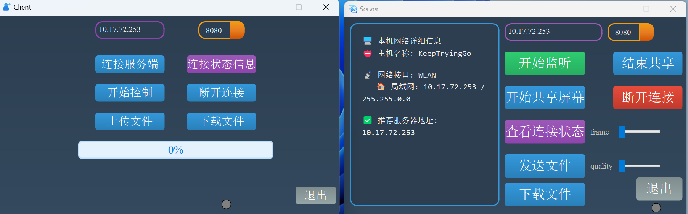


操作流程
========================
* 第一步：启动客户端和服务端软件
* 第二步：由于客户端和服务端IP框都会自动识别本机的IP地址，端口使用默认的，但是由于客户端要连接服务端，因此客户端的端口和IP地址要和服务端一样
* 第三步：服务端点击“开始监听”按钮，服务端处于监听状态（注意看服务端右下角的指示灯）
* 第四步：客户端点击“连接服务端”按钮，等待连接（注意看客户端右下角的指示灯）
* 第五步：客户端和服务端连接成功之后，指示灯变绿，表示连接正常
* 第六步：服务端点击“开始共享屏幕”按钮，客户端点击“开始控制”按钮，客户端即可弹出远程服务端的界面，并可以控制远程的服务端了
* 第七步：客户端和服务端都可以向对方发送文件以及下载文件（通过进度条可以实时查看上传文件的进度，服务端的聊天框会显示接收进度，发送文件亦然）
* 第八步：远程连接成功之后，客户端可以进行鼠标以及键盘的远程控制
* 第九步：如果要关闭显示屏幕的话，直接点击“隐藏屏幕”按钮即可，这个按钮是在点击客户端的“开始控制”按钮之后切换而来的
* 第十步：服务端也可以点击“结束共享”按钮
* 第十一步：服务端和客户端都可以查看连接状态信息
* 第十二步：如果不想连接了，可以直接断开连接


远程桌面协助项目功能讲解
=============================
整体功能流程图
-----------------------------
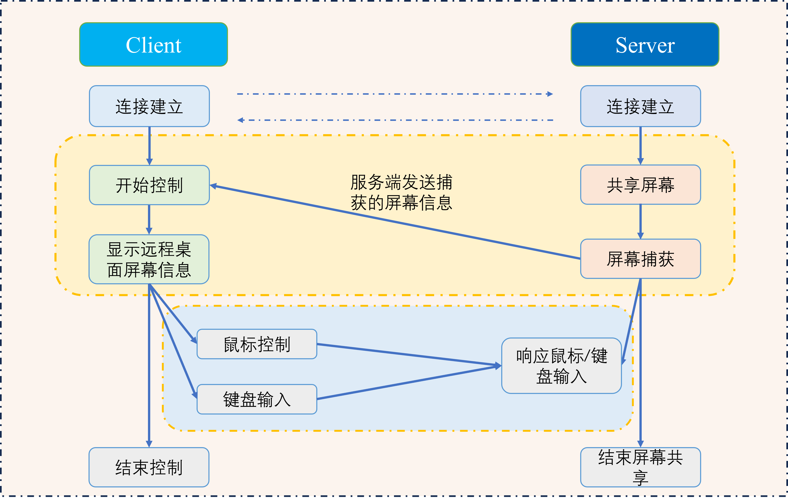

具体组件之间的交互
-----------------------------
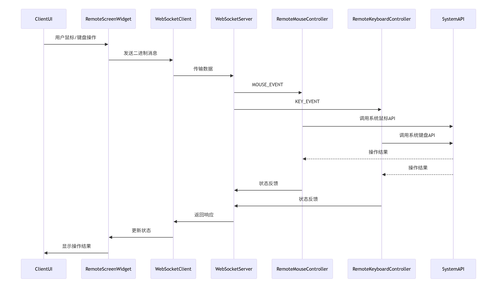


客户端和服务端远程通信和文件传输
-----------------------------
[请看之前我们讲解的websocket客户端和服务端通信和教程](https://blog.csdn.net/Keep_Trying_Go/article/details/151568114)


远程桌面显示
-----------------------------
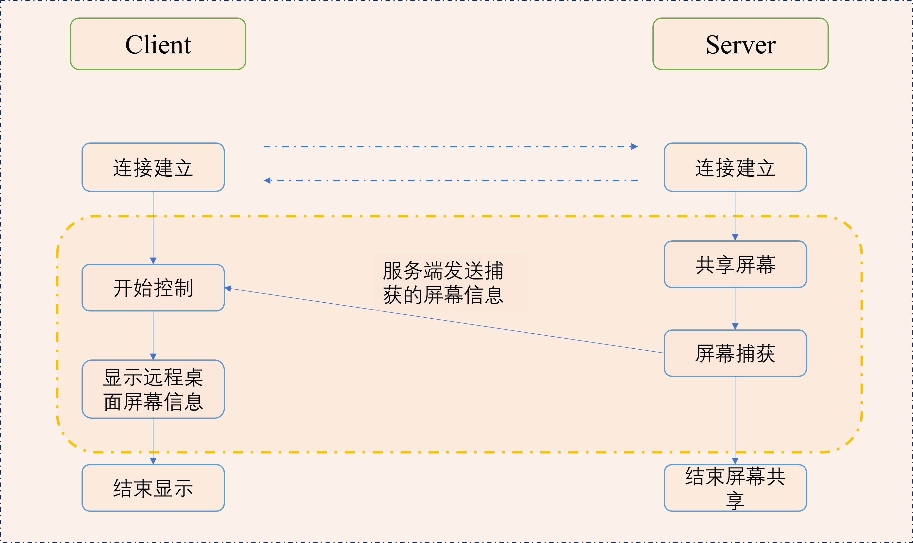


鼠标控制坐标转换
-----------------------------
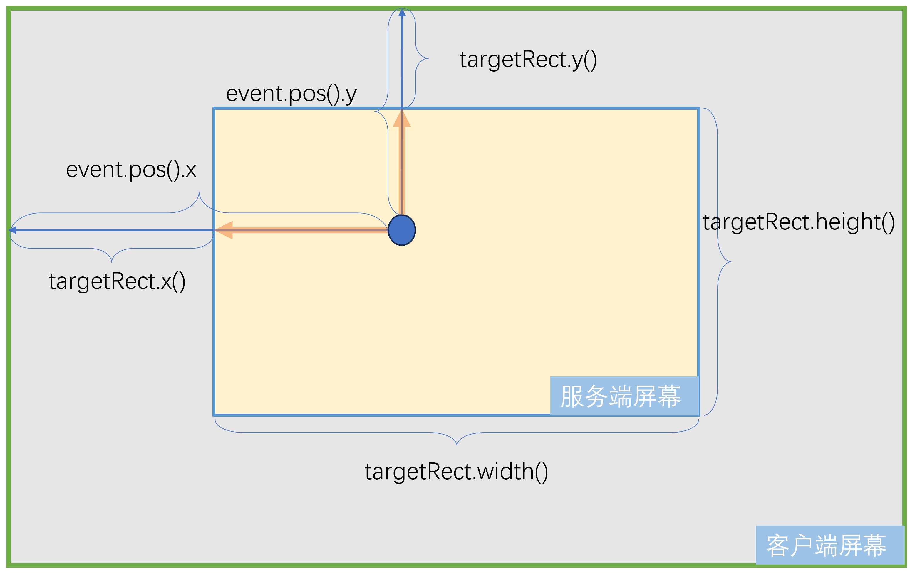
一定要注意这个我们当前客户端点击的鼠标位置和我们要传给服务端的鼠标点击位置之间的关系。


客户端鼠标和键盘事件处理
-----------------------------
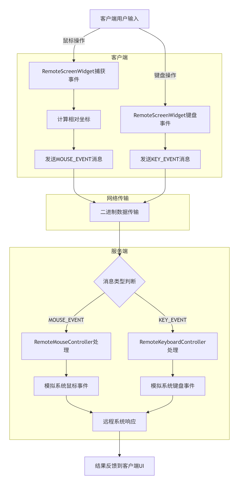
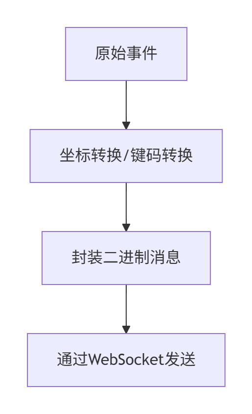


服务端接收鼠标和键盘事件处理
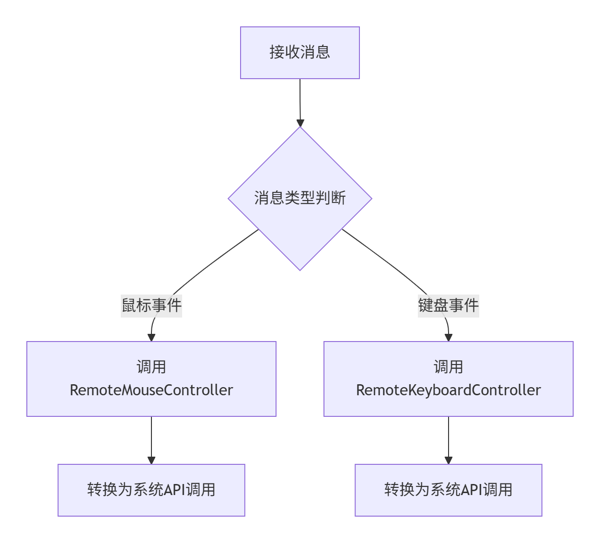


知识点
--------------------------
问题1：[关于QT6.6.0中使用websocket请看这里](https://blog.csdn.net/Keep_Trying_Go/article/details/151568114)

问题2：注意构建显示远程桌面的类RemoteScreenWidget要继承至
```
public QOpenGLWidget, protected QOpenGLFunctions
```

问题3：isInterruptionRequested()函数作用(安全地检查线程是否被请求中断)
* 线程中断检查​​: 允许线程在执行长时间任务时，定期检查外部是否请求中断（通过 requestInterruption()），从而安全退出。
* ​避免强制终止​​: 相比直接调用 QThread::terminate()（危险且可能导致资源泄漏-线程可以在中断前释放内存、关闭文件/网络连接等），isInterruptionRequested()提供了一种​​协作式​​的中断机制。

```
thread->requestInterruption();  // 主线程调用，请求子线程中断
thread->wait();  // 阻塞等待线程完全退出
```

问题4：断开信号和槽函数的连接
```
disconnect(m_screenCapturer, &ScreenCapturer::errorOccurred, this, nullptr); // 断开连接
```

问题5：QOverload<>::of(&RemoteScreenWidget::update)解决重载函数歧义的 Qt 语法

问题6：线程类，主线程类以及屏幕显示类三者关系
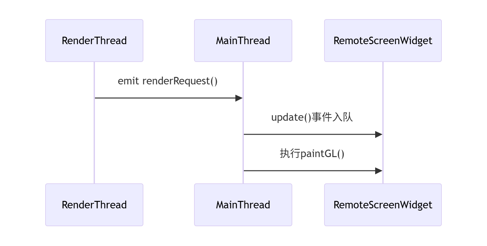

问题7：updateFrame()和 RemoteScreenWidget::update()的调用关系需要明确区分

|函数调用          |       触发方式 |      作用 |    线程安全机制|
|-----------------|----------------|----------|---------------|
|​​updateFrame()​​ |通过invokeMethod调用|更新帧数据 (m_currentFrame = frame) + ​​标记需要重绘​​ |通过Qt::QueuedConnection保证|
|​​RemoteScreenWidget::update()​​ |Qt内部自动调用 |触发paintGL()执行实际的OpenGL绘制|由Qt事件循环保证|

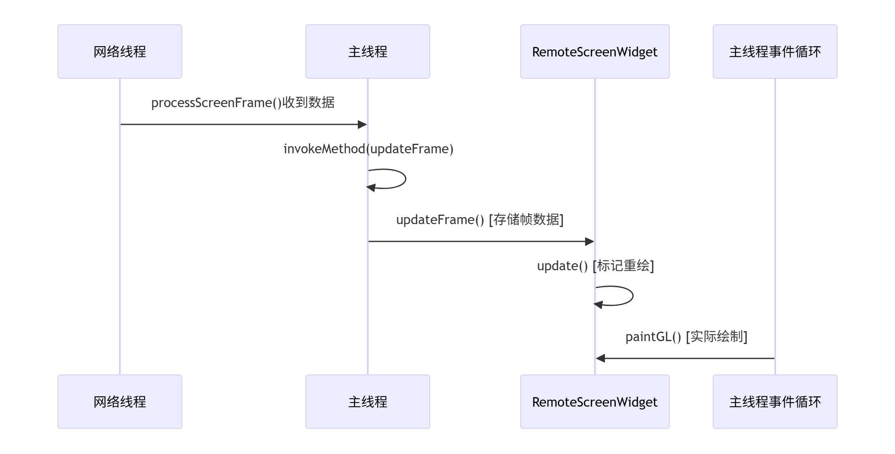
```
update()的底层行为​​:
    非立即绘制，而是​​向事件队列提交重绘请求​​
    下次事件循环时，Qt会自动调用paintGL()
```

问题8：发送键盘输入事件sendinput
```
​​系统输入队列​​：事件会被插入Windows系统的原始输入流（RAW Input Stream）
​​前台窗口​​: 最终由当前获得焦点的应用程序接收（与发送进程无关）
​​所有监听输入的进程​​：包括系统级钩子程序（如屏幕键盘、远程控制软件）
```
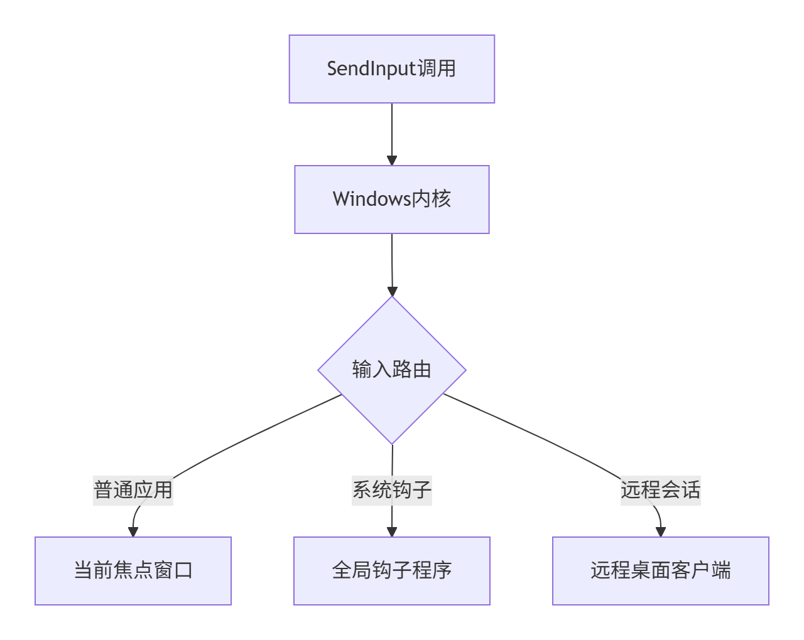


问题9：设置键盘输入获取焦点
```
void RemoteScreenWidget::setVisible(bool visible)
{
    // 设置当前局部可见还是不可见，并发送一个信号出去
    QOpenGLWidget::setVisible(visible);
    // 必须加入这句代码，必须让远程桌面的屏幕显示的获得焦距之后才能保证后面正常的输入
    if (visible) {
        setFocus(); // 显式获取焦点
        qDebug() << "Widget visible, has focus:" << hasFocus(); // 检查是否成功获取焦点
    }
    emit visibilityChanged(visible);
}
```

进一步思考
===========================
我们现在已经基于QT中的websocket实现了远程桌面协助这个项目，那相比于基于socket的TCP协议通信来实现远程桌面协助项目，有什么优缺点呢？

|特性           |  ​​  ​​WebSocket​​         |TCP Socket    |
|---------------|----------------------|--------------|
|​​​协议层级​​       |应用层协议（基于 HTTP 升级）|传输层协议  |
|​连接方式​​       |全双工、长连接          |全双工、长连接  |
|​消息边界​​       |支持帧（Frame）自动分包/合包|需手动处理粘包/拆包|
|​跨域支持​​       |支持（HTTP 同源策略）|不支持（需处理防火墙/NAT）|

WebSocket 的优势​​

* ​​更易实现实时交互​​
    * 内置 ​​消息分帧​​ 机制，无需手动处理粘包问题（TCP 需自定义协议如 长度+数据）。
    * 支持 ​​二进制帧​​ 和 ​​文本帧​​，适合传输屏幕帧（二进制）和指令（文本）。

* ​更好的穿透性​​
    * 默认使用 ​​80/443 端口​​，可绕过企业防火墙限制（TCP 自定义端口可能被拦截）。
    * 基于 HTTP 升级协议，兼容 Web 环境（浏览器可直接连接）。

* ​更简单的 API​​
    * Qt 提供 QWebSocket类，封装了连接管理、消息分帧等逻辑，开发效率高。
    * TCP 需手动实现 QTcpSocket的状态管理、重连机制等。

* ​​支持跨平台/跨语言​​
    * WebSocket 是标准协议，客户端可以是 ​​浏览器、移动端、桌面应用​​。
    * TCP 需统一序列化格式（如 Protobuf），且浏览器无法直接连接。

​​TCP Socket 的优势​​

* ​更灵活的协议设计​​
    * 可完全自定义协议（如自定义压缩、加密），优化传输效率。


* ​更低的延迟​​
    * 直接操作字节流，省去 WebSocket 的帧解析步骤，​​延迟更低​​（微秒级差异）。

其实到底是应用websocket还是基于socket的TCP协议，这个并没有一个完全的答案，基于socket的TCP协议需处理 ​​粘包/拆包​​、心跳保活、断线重连等底层细节，而QT只不过帮我们封装了websocket的底层细节，让我们在传输数据和接收数据使用起来更加的方便，但是并不代表websocket就一定是首选。

Windows上程序打包为exe可执行文件
===============================
[打包工具下载链接](https://enigmaprotector.com/en/downloads.html)

[打包工具安装教程](https://blog.csdn.net/qq_39172792/article/details/145546784?ops_request_misc=&request_id=&biz_id=102&utm_term=enigma%E6%89%93%E5%8C%85%E5%B7%A5%E5%85%B7%E4%B8%8B%E8%BD%BD&utm_medium=distribute.pc_search_result.none-task-blog-2~all~sobaiduweb~default-0-145546784.142^v102^pc_search_result_base4&spm=1018.2226.3001.4187)

[打包工具使用教程](https://blog.csdn.net/qq_35246754/article/details/130831140)


漂亮的图标网站
=========================
https://unicode.org/emoji/charts/full-emoji-list.html

https://getemoji.com/

https://emojipedia.org/emoji-mashup/twitter/twemoji-14.0?a=%F0%9F%98%80&b=%F0%9F%98%86

https://www.iconfinder.com/

https://www.flaticon.com/


